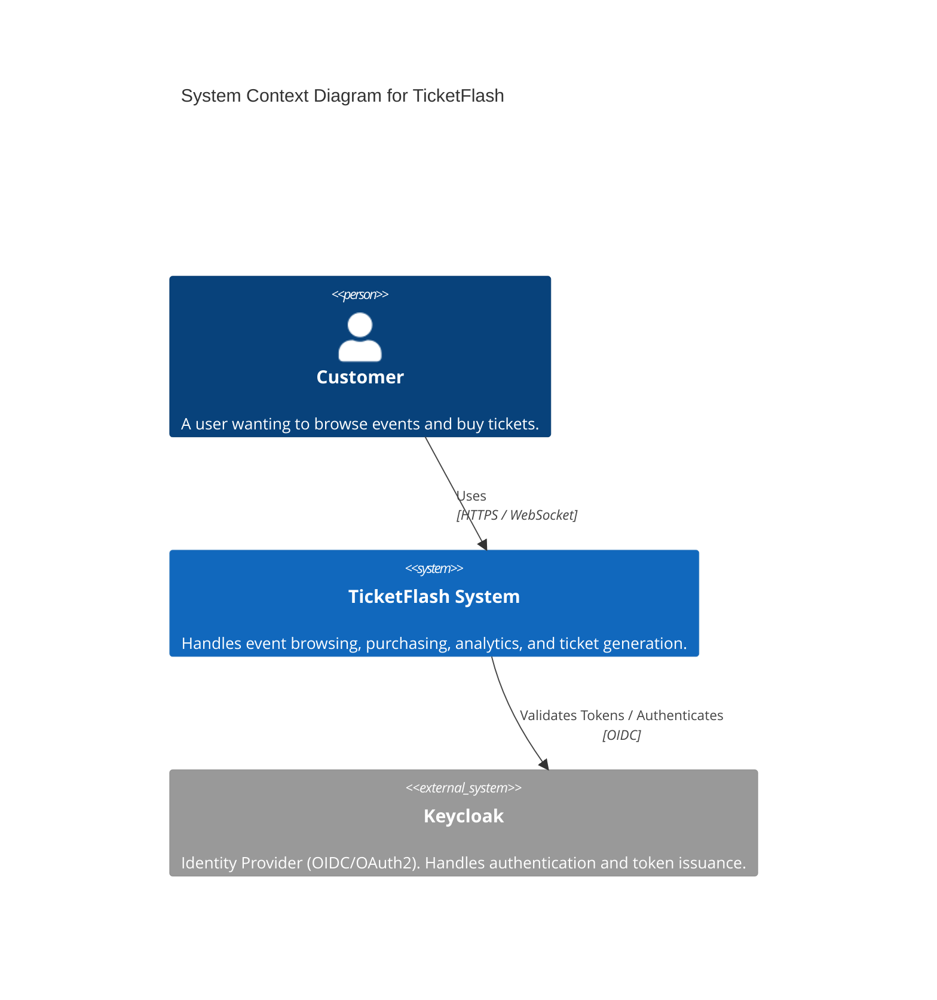
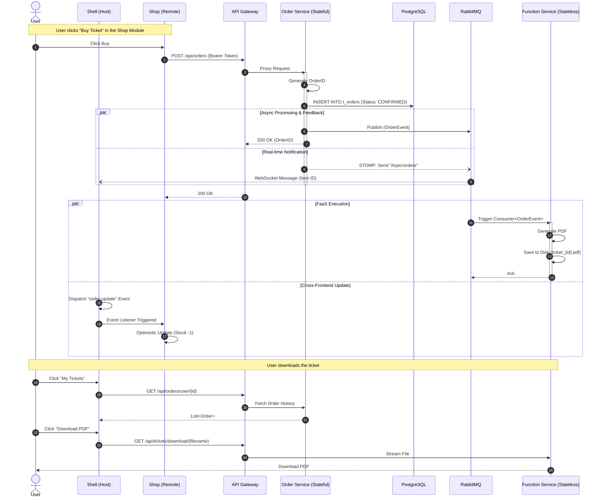

# TicketFlash System Documentation

## 1. System Overview

TicketFlash is a high-performance, distributed event ticketing platform. It is designed to handle high concurrency using an event-driven microservices architecture. The system features a Micro-Frontend user interface, Asynchronous order processing, Real-time updates via WebSockets, and Serverless-style document generation.

## 2. C4 Model: System Context

This diagram illustrates the high-level interactions between the User, the TicketFlash System, and external identity providers.

## 3. C4 Model: Container Diagram

This diagram details the internal components, including the Micro-Frontend Architecture and the Microservices backend.

```mermaid
C4Container
    title Container Diagram - TicketFlash Architecture

    Person(user, "User", "Web Browser")

    Container_Boundary(frontend, "Micro-Frontend Layer") {
        Container(shell, "Shell (Host)", "Angular 17", "Main layout, Authentication, WebSocket connection, Dashboard.")
        Container(shop, "Shop (Remote)", "Angular 17", "Inventory browsing and Ticket purchasing logic. Loaded via Module Federation.")
    }

    Container_Boundary(gateway_layer, "Edge Layer") {
        Container(gateway, "API Gateway", "Spring Cloud Gateway", "Routing, Load Balancing (Client-Side), Security.")
        ContainerDb(discovery, "Eureka Server", "Service Registry", "Service Discovery.")
    }

    Container_Boundary(services, "Microservices Layer") {
        Container(inventory, "Inventory Service", "Spring Boot", "Manages event stock.")
        Container(order, "Order Service", "Spring Boot", "Stateful transaction handler. Persists orders and publishes events.")
        Container(analytics, "Analytics Service", "Spring Boot", "Ingests high-volume user activity streams.")
        Container(faas, "Function Service (FaaS)", "Spring Cloud Function", "Stateless PDF Generator worker bound to RabbitMQ.")
    }

    Container_Boundary(infra, "Infrastructure Layer") {
        ContainerDb(db, "PostgreSQL", "SQL Database", "Stores Orders and Inventory data.")
        ContainerDb(broker, "RabbitMQ", "Message Broker", "Handles async order processing and WebSocket Relay.")
        ContainerDb(kafka, "Kafka", "Event Streaming", "Handles analytics streams.")
    }

    Rel(user, shell, "Loads App", "HTTPS")
    Rel(shell, shop, "Lazily Loads", "Module Federation")
    Rel(shell, gateway, "API Calls", "HTTPS / JSON")
    Rel(shell, gateway, "Live Updates", "WebSocket (STOMP)")

    Rel(gateway, discovery, "Service lookup", "Eureka API")
    Rel(gateway, inventory, "Routes", "lb://inventory-service")
    Rel(gateway, order, "Routes", "lb://order-service")
    Rel(gateway, analytics, "Routes", "lb://analytics-service")
    Rel(gateway, faas, "Routes", "lb://function-service")

    Rel(inventory, db, "Reads/Writes Stock", "JDBC")
    Rel(order, db, "Saves Orders", "JDBC")
    Rel(order, broker, "Publishes Order Event", "AMQP")
    Rel(faas, broker, "Consumes Order Event", "AMQP")
    Rel(analytics, kafka, "Publishes Events", "TCP")

    %% Layout and relationship tweaks to minimize overlaps
    UpdateLayoutConfig($c4ShapeInRow="4", $c4BoundaryInRow="1")

    UpdateRelStyle(user, shell, $offsetY="-35")
    UpdateRelStyle(shell, shop, $offsetY="30")
    UpdateRelStyle(shell, gateway, $offsetX="40", $offsetY="-25")
    UpdateRelStyle(shell, analytics, $offsetY="60")

    UpdateRelStyle(gateway, discovery, $offsetX="55", $offsetY="-38")
    UpdateRelStyle(gateway, inventory, $offsetX="-55", $offsetY="25")
    UpdateRelStyle(gateway, order, $offsetX="45", $offsetY="15")
    UpdateRelStyle(gateway, analytics, $offsetY="-35")
    UpdateRelStyle(gateway, faas, $offsetY="40")
    UpdateRelStyle(shell, gateway, $offsetX="60", $offsetY="-30")
    UpdateRelStyle(shell, shop, $offsetY="25")

    UpdateRelStyle(order, db, $offsetY="38")
    UpdateRelStyle(inventory, db, $offsetX="48")
    UpdateRelStyle(order, broker, $offsetY="-30")
    UpdateRelStyle(faas, broker, $offsetY="32")
    UpdateRelStyle(analytics, kafka, $offsetY="-25")
```

## 4. UML Sequence Diagram: The "Buy Ticket" Flow

This diagram demonstrates the complex Asynchronous Transaction and Optimistic UI Updates that occur when a user purchases a ticket.

## 5. Technology Stack Summary

| Component       | Technology            | Role                                                                        |
|-----------------|-----------------------|-----------------------------------------------------------------------------|
| Frontend Host   | Angular 17            | Shell application, Authentication, WebSocket management.                    |
| Frontend Remote | Angular 17            | Shop module (Inventory/Tickets), loaded via Webpack Module Federation.      |
| Gateway         | Spring Cloud Gateway  | Entry point, Security (OAuth2 Resource Server), Client-Side Load Balancing. |
| Discovery       | Netflix Eureka        | Dynamic service registration and discovery.                                 |
| Communication   | REST / STOMP / AMQP   | Synchronous API calls, Real-time Push, and Asynchronous Messaging.          |
| Order Service   | Spring Boot           | Core business logic, Transaction management, State persistence.             |
| FaaS            | Spring Cloud Function | Stateless PDF generation bound to RabbitMQ via Spring Cloud Stream.         |
| Analytics       | Spring Boot + Kafka   | High-throughput event ingestion and stream processing.                      |
| Infrastructure  | Docker Compose        | Orchestration of Postgres, Redis, RabbitMQ, Kafka, Zookeeper, and Keycloak. |
